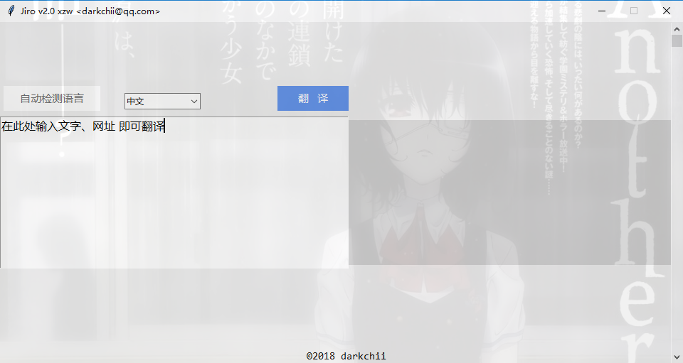

# Jiro Translate app
> **这是一个使用 `python` 编写的翻译器.**

# 用到的技术
* 目前程序用到`requests`、`BeautifulSoup`包。
> 以后还会添加界面、程序打包.exe文件等功能，彼时我将添加上。
* 百度搜索引擎

# 声明
> 程序为个人学习、研究而开发，程序翻译结果皆来自百度搜索引擎，使用本程序者所造成的任何后果本人概不负责。

# Version update log
* 最初版本
  * [v0.0.1](translator.py)

* [v0.0.6](E2C&C2E.py)<sup>1</sup>
  * 增加了英文句子翻译、部分中文词语翻译、检测输入是否合法功能。
  修改了异常处理、部分变量名。

* [v0.0.8版](transApp.py)<sup>3</sup>
  * 修改原代码中165 ~ 171行:
  ```python
  # 单词类的会匹配到多余的最后3个：[双语例句 汉英大词典 中中释义] 所以截取掉
  if len(translatorOfEnglish) > 4:
      for i in range(len(translatorOfEnglish[:-4])):
          print(translatorOfEnglish[i] + ';')
  else:
      print(translatorOfEnglish[0] + ';')
  ```
  改为：
  ```python
  # 有时会匹配到多余的几个：[双语例句 汉英大词典 中中释义 进行更多翻译]。所以截取掉
  for i in range(len(translatorOfEnglish)):
      if translatorOfEnglish[i] in redundancy:
          break
      print(translatorOfEnglish[i] + ';')
  ```
  其中redundancy是一个新添加的列表变量：`redundancy = ['双语例句','汉英大词典','中中释义','进行更多翻译']`

* [v1.0](JiroApp.py)<sup>2</sup>
  * 重构了transApp.py底层，使用技术为百度api。
  * 翻译软件名更改为 Jiro Translator。关于名字由来：Jiro是我家即将送出去的一只猫，他出生时给他取名叫次郎，所以就使用了罗马音来命名这个软件。
  
* [v1.1](JiroApp.py)<sup>2</sup>
  * 修复`sug api`只支持单词、词语类型翻译的bug，因为它在html页面中是一个字符一个字符的接收并翻译的，为了方便，因而摒弃掉使用这个api进行翻译。目前使用的api为`baidu_transapi`。
  * 创建了`transapi.py`<sup>4</sup>文件，该文件提供翻译需要的api。
  * 程序支持多国语言翻译为`[中文，英语，日语]`。

* [v1.2](JiroApp.py)<sup>2</sup>
  * 修复异常处理的bug。
  
* [v2.0](Jiroapp/Jiro.py)
  * 增加了Jiro的UI
    * 效果图：
    

# 旁注释义
[1]: 原文件名 E2C&C2E.py 已于 2018/2/28 pm 修改为 transApp.py
[2]: 原文件名 JiroApp.py 已于 2018/3/1 pm 修改为 [translate.py](Jiroapp/translate.py)
[3]: 原文件名 transApp.py 已于 2018/3/1 pm[trans.py](trans.py)
[4]: 该文件可到这里查看[transapi.py](Jiroapp/transapi.py)

